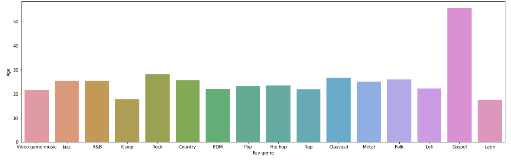
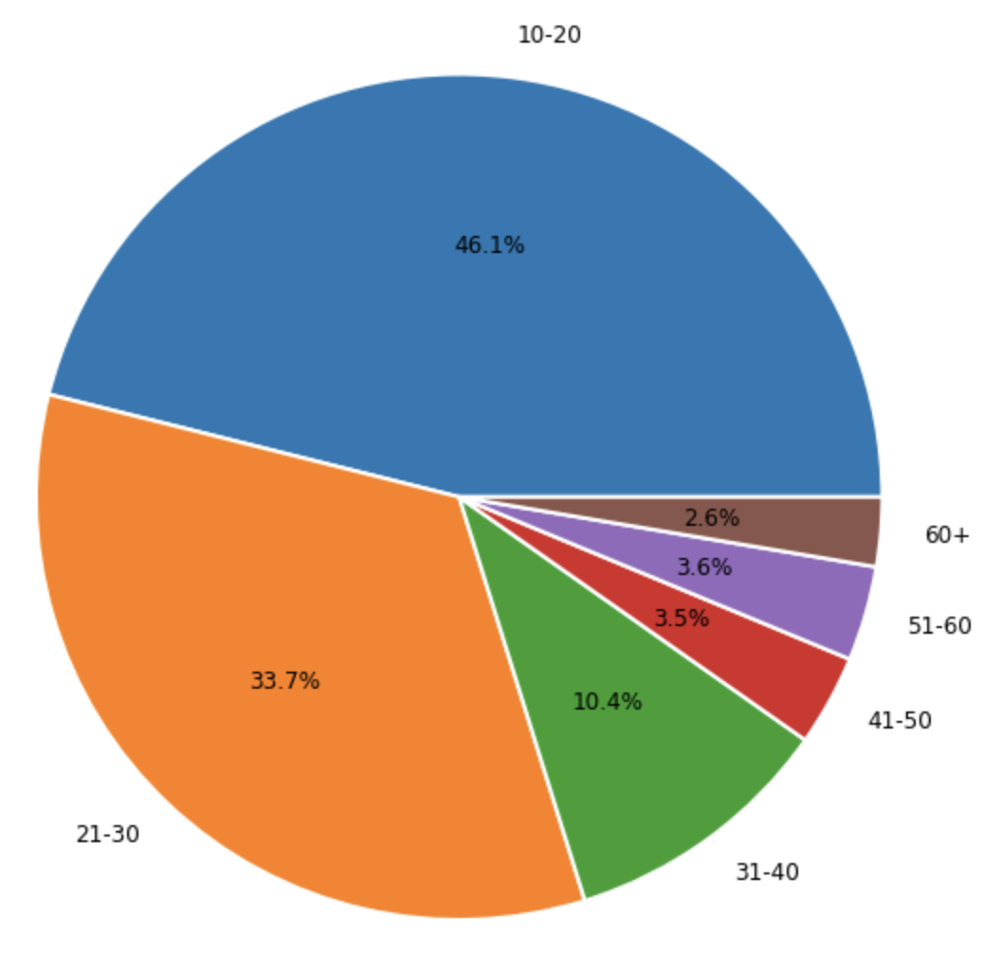
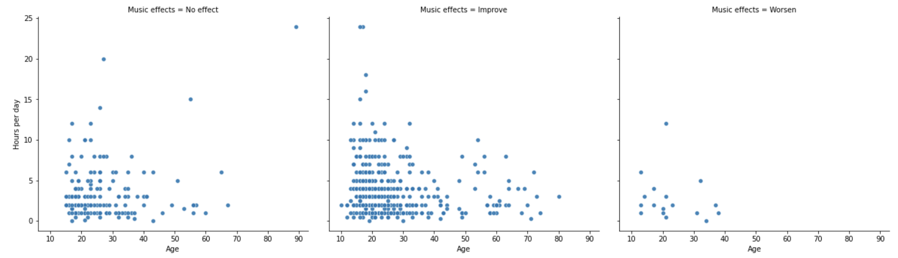
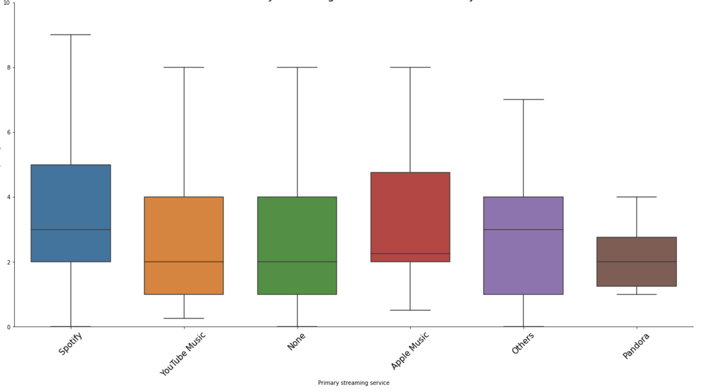

# 🎶 MUSIC THERAPY ON MENTAL HEALTH 🎶 
### Data Visualization and Regression 

## 🔑 Purpose

The Music and Health dataset wants to recognize if there are any existing connections between a person's taste in music and their self-reported mental health. The aim of this project is to build a model that will help predict the effects of music on a person based on a few predictors and to know if Music Therapy helps in preventing or aiding mental conditions.

## 🗳️ Data Information

The raw data is was collected through Google form and uploaded as csv file on [Kaggle Music & Mental Health Survey Results](https://www.kaggle.com/code/hazigin/music-mental-health-survey-results-eda/data). There are 736 rows and 33 columns in the dataset.
#### Column names with corresponding descriptions:
- **Timestamp** - Date and Time when form was submitted
- **Age** - Age of respondent
- **Primary Streaming Service** - Respondent's primary streaming service
- **While working** - Respondent is listening to music while studying or working
- **Instrumentalist** - Respondent plays any instrument regularly
- **Composer** - Respondent composes music
- **Fav Genre** - Respondent's favorite genre
- **Exploratory** - Respondent explores new genres'artist regularly
- **Foreign Languages** - Respondent listens to songs that are in foreign language
- **BPM** - Beats per minute of respondent's favorite genre
- **Frequency [Genre]** - Frequency of listening to the genre given
- **Anxiety** - On a scale of 0-10, self-reported anxiety
- **Depression** - On a scale of 0-10, self-reported depression
- **Insomnia** - On a scale of 0-10, self-reported insomnia
- **OCD** - On a scale of 0-10, self-reported OCD
- **Music Effects** - Does music improve or worsen the mental health conditions of the respondent
- **Permissions** - Permission to publicize data

## 📊 Data Visualization

