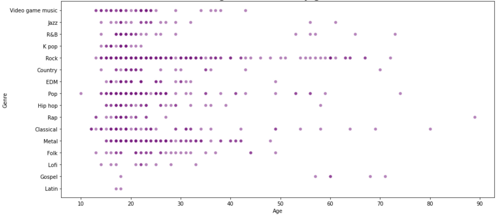
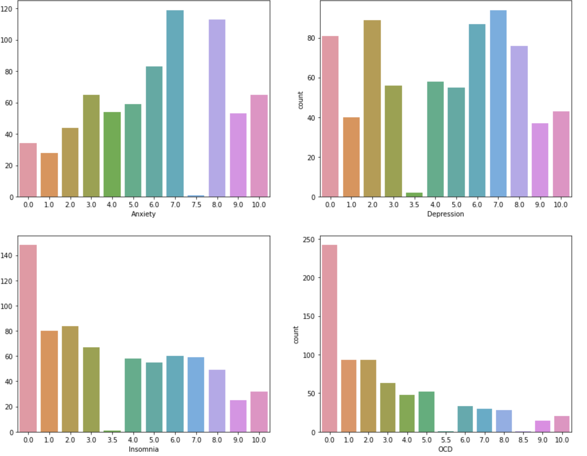

# 🎶 MUSIC THERAPY ON MENTAL HEALTH 🎶 
### Data Visualization and Regression 

## 🔑 Purpose

The Music and Health dataset wants to recognize if there are any existing connections between a person's taste in music and their self-reported mental health. The aim of this project is to build a model that will help predict the effects of music on a person based on a few predictors and to know if Music Therapy helps in preventing or aiding mental conditions.

## 🗳️ Data Information

The raw data is was collected through Google form and uploaded as csv file on [Kaggle Music & Mental Health Survey Results](https://www.kaggle.com/code/hazigin/music-mental-health-survey-results-eda/data). There are 736 rows and 33 columns in the dataset.
#### Column names with corresponding descriptions:
- **Timestamp** - Date and Time when form was submitted
- **Age** - Age of respondent
- **Primary Streaming Service** - Respondent's primary streaming service
- **While working** - Respondent is listening to music while studying or working
- **Instrumentalist** - Respondent plays any instrument regularly
- **Composer** - Respondent composes music
- **Fav Genre** - Respondent's favorite genre
- **Exploratory** - Respondent explores new genres'artist regularly
- **Foreign Languages** - Respondent listens to songs that are in foreign language
- **BPM** - Beats per minute of respondent's favorite genre
- **Frequency [Genre]** - Frequency of listening to the genre given
- **Anxiety** - On a scale of 0-10, self-reported anxiety
- **Depression** - On a scale of 0-10, self-reported depression
- **Insomnia** - On a scale of 0-10, self-reported insomnia
- **OCD** - On a scale of 0-10, self-reported OCD
- **Music Effects** - Does music improve or worsen the mental health conditions of the respondent
- **Permissions** - Permission to publicize data

## 📊 Data Visualization
<h5 align="center">DISTRIBUTION OF FAVORITE GENRE AS PER AGE GROUP</h5> 

<h5 align="center">THE EFFECTS OF MUSIC ACCORDING TO AGE AND THE NUMBER OF HOURS A DAY THE RESPONDENTS LISTEN TO MUSIC</h5> 

<h5 align="center">AGE DISTRIBUTION BY GENRE</h5> 

<h5 align="center">HOURS PER DAY A RESPONDENT ALLOCATES TO THE STREAMING SERVICES</h5> 

<h5 align="center">MENTAL HEALTH AND THE CORRESPONDING NUMBER OF SELF-REPORTS</h5> 

## ✨ Simple Regression Models with Seaborn

## 📘 Model Creation
 **1. Anxiety predictors** - Simple linear regression model and multiple regression model
 **2. Depression predictors** - Simple linear regression model and multiple regression model
 **3. Insomnia predictor** - Multiple regression model
 **4. OCD predictor** - Multiple regression model
 **5. Music Effects** - Logistic Classification Model

## 🌑 Conclusion

 Music genres like Folk music, Kpop, Hiphop, Lofi, Rock and Pop has a positive effect on the anxiety level of the respondent which means that the more they listen to these types of music, the higher the chances of their anxiety levels to increase.different factors may have different impacts on a persons anxiety level. Respondents who are listening to music while working or studying, who are instrumentalists, who are listening to foreign language music and are in their 51-60s have lesser chances of having higher levels of anxiety compared to the others. Listening to Lofi escalates the chances of a person to suffer more from depression. For the last model, music effects, needs more data because there is a clear imbalance in the data distribution. The best way to improve this model is to gather more sample data for the two other classes.
